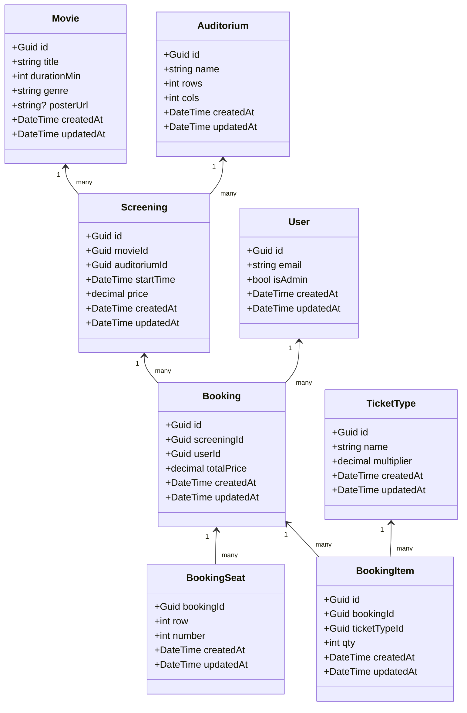

# H3-BioOpg (Cinema App)

Full-stack cinema app:
- Angular 16+ frontend
- ASP.NET Core 8 Web API with EF Core 8 and PostgreSQL
- Uploads microservice (Node/Express + Multer) for poster images

Everything runs via Docker Compose + a Makefile.

## Quick start (Docker)

Prereqs: Docker Desktop

```bash
make up          # start db, api, upload server, and Angular dev server
make seed        # run EF Core migrations + seed data (idempotent)
make open        # macOS convenience: opens Web, Swagger, pgAdmin
```

URLs:
- Website: http://localhost:4200
- API: http://localhost:5099 (Swagger: http://localhost:5099/swagger)
- Uploads: http://localhost:3001
- pgAdmin: http://localhost:5050

Common tasks:
```bash
make ps          # show services
make logs        # tail logs
make rebuild-api # rebuild API image and restart it
make down        # stop services
make clean       # stop & remove volumes (resets DB and uploaded files)
```

Resilience:
- The API ensures the Postgres `public` schema exists on startup and sets EF’s default schema to `public`, so `make up` and `make seed` work even if `public` was dropped.

## Project layout
- Angular app: `src/`
- API solution: `Backend/` (EF Core, repositories/services/controllers)
- Upload server: `upload-server.js` (serves `uploads/`)
- Compose & Make: `docker-compose.yml`, `Makefile`
 
## Assignment compliance (H3)
- Entities/classes (6–14): 8 domain entities: `Movie`, `Auditorium`, `Screening`, `User`, `Booking`, `BookingSeat`, `BookingItem`, `TicketType`.
- Login: Implemented with JWT. API issues/validates tokens; Angular stores and uses JWT.
- M–M represented: `Movie`–`Auditorium` via `Screening`; `Booking`–many seats via `BookingSeat`.
- Klassediagram: Included below (Mermaid).
- Use cases for a class: Provided for Booking below.
- ORM and extra queries: EF Core used; stats endpoints perform multiple queries beyond CRUD.
- SQL injection: Intentional lab endpoint `POST /hack/sql` executes raw SQL (education only).
- Webserver: C# .NET 8, layered structure (Controllers → Services → Repositories → EF Core).
- Interfaces between layers: Services/Repositories defined behind interfaces.
- GUI: Angular app with auth guards/interceptor, admin area, booking flow.
- Tests: Unit tests for controllers, services, and repositories in `Backend/BiografWeb.Test`.
- Extra topics: Extension methods and delegates implemented in `Backend/BiografWeb.Domain/Extensions/StringExtensions.cs`.

## Backend details
- Database: Postgres 16
- EF Core migrations applied on API start; seed controlled by env flags the Makefile passes:
  - `SEED_DB=true`, `SEED_ONLY=true` used by `make seed`
- Seeders populate movies, auditoriums, ticket types, screenings, users, bookings.
- API endpoints (prefix `api/`):
  - `GET/POST/PUT/DELETE /api/movies`
  - `GET/POST/PUT/DELETE /api/screenings`
  - `GET/POST/PUT/DELETE /api/auditoriums`
  - `GET/POST/PUT/DELETE /api/users`
  - `GET /api/users/byEmail?email=...`
  - `GET/POST/PUT/DELETE /api/bookings`

Authentication:
- API issues and validates JWTs (HMAC SHA-256). Login via `POST /api/auth/login` with `{ "email": "", "password": "" }`.
- Admin policy via `isAdmin` claim; protected routes enforced by JWT bearer auth.

## Frontend details
- Dev server runs on http://localhost:4200 with a proxy (`proxy.conf.json`) to backend services:
  - `/api` → API (http://api:5099 inside Compose → http://localhost:5099)
  - `/upload`, `/uploads` → Upload server (http://localhost:3001)
  - `/hackapi` → API root (reserved for lab endpoints)
- Routes:
  - `/` browse movies; `/movies/:id` details
  - `/screenings/:id/book` booking screen
  - `/login`, `/register`
  - `/admin/*` for Movies, Screenings, Auditoriums, Users (guarded by role Admin)
 
Auth in Angular:
- Stores JWT in `localStorage`, decodes payload for `isAuthenticated`, `isAdmin` guards.
- HTTP interceptor attaches JWT to API requests.

## Upload server
- Runs on port 3001
- Static files: `GET /uploads/*`
- Poster upload: `POST /upload/poster` (multipart form-data field `file`, ≤5MB, JPEG/PNG)
- Response: `{ "url": "/uploads/posters/<filename>" }`

```bash
# Angular
npm install
npm start

# API
dotnet restore Backend/BiografWeb.sln
dotnet build Backend/BiografWeb.sln -c Debug
dotnet run --project Backend/BiografWeb.Api/BiografWeb.Api.csproj
```

### Class diagram



### Use cases: Booking

- Create booking
  - Actor: Authenticated user
  - Preconditions: Screening exists; seats available
  - Main flow: Select seats and ticket quantities → system calculates total price → create booking
  - Alternate/errors: Seat already taken → show error; invalid qty → reject
  - Postconditions: Booking stored; seats reserved

- Update booking items
  - Actor: Authenticated user
  - Preconditions: Booking belongs to user; screening not yet started
  - Main flow: Adjust quantities → recalculate total → save
  - Errors: Past start time → reject
  - Postconditions: Updated totals persisted

- Cancel booking
  - Actor: Authenticated user or Admin
  - Preconditions: Booking exists; within cancel window
  - Main flow: Cancel/delete booking; release seats
  - Errors: Too late → reject
  - Postconditions: Seats released

- View booking history
  - Actor: Authenticated user
  - Main flow: List user’s bookings with totals and next screening time

## Handlingsoversigt (User Actions Overview)

- Public
  - Browse movies: view poster, title, genre, duration
  - Movie details: see info and upcoming screenings
  - Screening page: pick seats, see price
- Authentication
  - Register: create account with email + password
  - Login/Logout: access protected routes
- Booking
  - Create booking: choose screening, select seats, select ticket types, confirm
  - View booking (list in UI, via admin or future profile)
  - Cancel/update booking (future enhancement)
- Admin (requires Admin role)
  - Movies: list, create, edit, delete; upload poster
  - Screenings: list, create, edit, delete
  - Auditoriums: list, create, edit, delete
  - Users: list, create, edit, delete
  - Stats (per entity): overview endpoints available in API
- Experimental (for lab)
  - SQL lab: run raw SQL (educational; not for production)

### Typical flows
- Create booking
  1) Find movie → choose screening → select seats and ticket types → confirm
- Add new movie (admin)
  1) Go to Admin → Movies → New → fill title/genre/duration → optionally upload poster → Save
- Register and login
  1) Register with email/password → Login → access Admin (if admin)

## Architecture & layers
- Controllers (Web API) → Application services (interfaces) → Infrastructure repositories (interfaces) → EF Core (DbContext).
- Interfaces: `Application/*/I*Service.cs`, `Application/*/I*Repository.cs`.
- EF Core: `AppDbContext` with snake_case mapping and default schema `public`.
- Migrations auto-applied on startup; seeding optional via env flags.

## Testing
- Controller tests (per entity), service tests, repository tests under `Backend/BiografWeb.Test`.
- Test infra includes isolated DB setup and timestamp tests.

## Security lab (SQL injection)
- Endpoint: `POST /hack/sql` with body `{ "sql": "<your SQL>" }` executes raw SQL; returns rows/affected or error message.
- For educational purposes only; do not enable in production.

## Extras and ideas
- Implement pagination for list endpoints and Angular tables.
- Add breadcrumbs to key pages.
- Showcase reflection/generics (e.g., simple validation via attributes + reflection).
- Add screenshots or sequence/flow diagrams if desired.